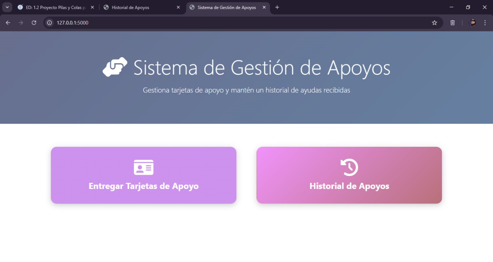
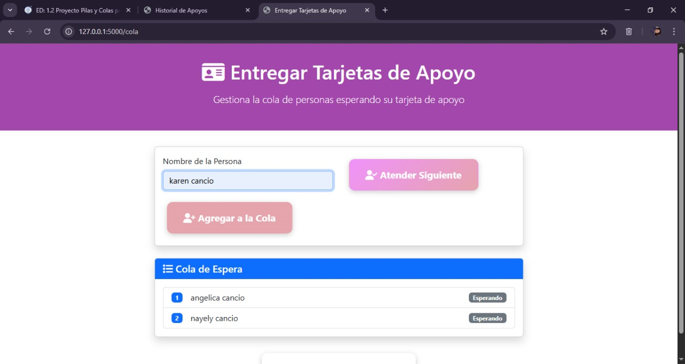
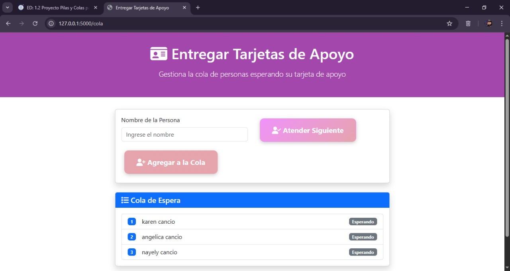

# Un Sistema de Apoyos (Pila y Cola) con python

Sistema de Gestión de Apoyos con Cola y Pila – Descripción
Este sistema web, desarrollado en Python con Flask, gestiona de forma ordenada la entrega de apoyos a personas que se registran para recibirlos.

Los usuarios ingresan su nombre para registrarse y formar parte de una cola de espera.
Una pila para almacenar el historial de apoyos entregados.

## Datos del Estudiante 🍎

- **Nombre:** Nayely Cancio Bautista
- **Materia:** Estructura de Datos ୨ৎ
- **Profesor:** Kevin David Molina Gomez ☆
- **Semestre:** 6to Semestre 

## **Diseño de interfaz**💛

La interfaz del sistema esta diseñada con un enfoque claro y centrado, utilizando HTML, Bootstrap y el framework web Flask. Este diseño busca ofrecer una experiencia clara, ordenada y funcional para el registro, atencion y el seguimiento de personas que solicitan el apoyo.

## **Instrucciones de ejecucion** ⭐

1. Asegurate de tener Python 3.13.5 instalado correctamente
2. Instala las dependencias:
    
    Pip instal flask (gestor de paquetes de Python)

3. Estructura minima del proyecto    
    
    **/tu-proyecto**
│
├── **app.py**
│──**README.md**
├── **models/**
│   ├── **cola.py**
│   └── **pila.py**
└── **templates/**
    └── **menu.html**
    ├── **cola.html**
    └── **pila.html**

3. Ejecutar el sistema

    python main.py (veras algo como http://127...)

4. Acceder desde el navegador    

